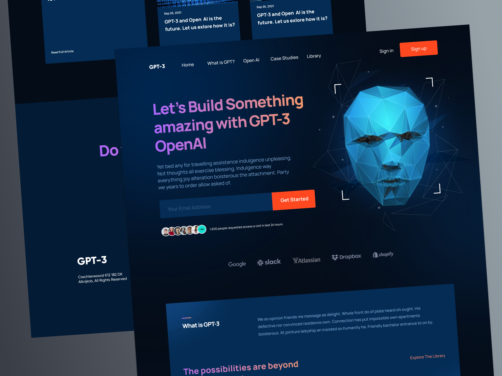

<!-- PROJECT LOGO -->
 

    
    &nbsp;
    

<h3 align="center">HooBank</h3>
  

    HooBank // Single Page Landing
     
  

<!-- TABLE OF CONTENTS -->

  
Table of Contents

  <ol>
    <li>
      <a href="#about-the-project">About The Project</a>
      <ul>
        <li><a href="#built-with">Built With</a></li>
      </ul>
    </li>
  </ol>

<!-- ABOUT THE PROJECT -->
## About The Project
Found a great design file to work with. Production is hella easy like this. 😍

### Built With
* Vite.js
* React
* Figma // check out the Figma file <a href="https://www.figma.com/file/WnoAGy24iwoRnJ79m5MgXL/HooBank?node-id=0%3A1&t=RzWYc0RMa2q9ovLK-1">here</a> 
* Vercel
